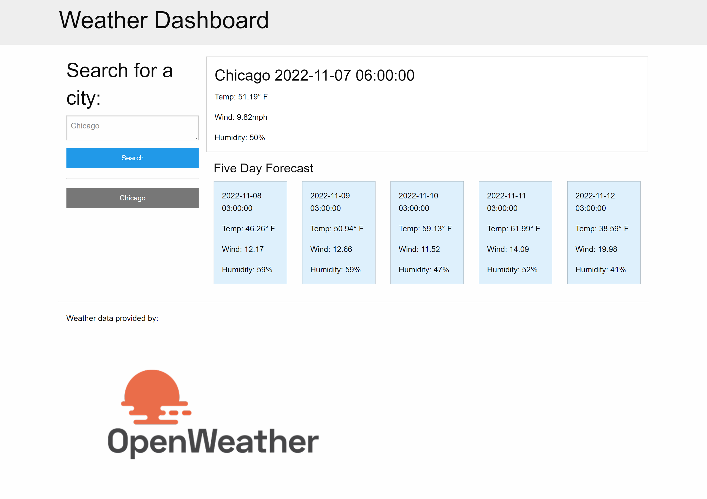

# Weather Dashboard

## Description

This repository is where I built a weather dashboard that runs in browser and uses third-party APIs (see credits below). 

## Installation

N/A

## Usage

[Deployed website] (https://mmmatson.github.io/weather-dashboard/)

Search for a city to be presented with current and future conditions for that city. Under current weather conditions, you will see the city name, date, an icon representation of weather conditions, the temperature, the humidity, and the wind speed. Under future weather conditions, you will see a 5-day forecast that displays the date, an icon representation of weather conditions, the temperature, the wind speed, and the humidity. 

When you search for a city, that city will be added to the search history. When you click on a city in the search history, you will be shown the current and future conditions for that city.

## Credits

I used the [5 Day Weather Forecast](https://openweathermap.org/forecast5) and the [Geocoding](https://openweathermap.org/api/geocoding-api) APIs from OpenWeather to retrieve weather data for cities.

## License

See repository for license information.